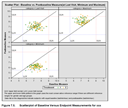

### White Paper on Central Tendency Task List

The Repository Content team aim to deliver a package of robust, easy to use and understand SAS and R scripts that create the WPCT standard analyses and displays. For further details, see [the README file in this folder](./README.md).

**Contents:**
 1. [To-do list to complete the WPCT package](http://github.com/phuse-org/phuse-scripts/blob/master/whitepapers/WPCT/TODO.md#to-complete-the-wpct-package)
 2. [Table: Implementation Status of WPCT Figures](http://github.com/phuse-org/phuse-scripts/blob/master/whitepapers/WPCT/TODO.md#wpct-figures--scripts-with-qualification-details)

**But feel free to be creative** when considering the expertise that you can contribute:
* Do you have Spotfire expertise, and time to create templates for these analyses?
* Do you have RStudio Shiny expertise, and time to create a web interface to our R scripts?
* Other expertise in Testing, Spec writing, Documentation, etc?

#### To Complete the WPCT package

Scripts below by default produce outputs based on a specific ADaM domain such as Vital Signs. The Central Tendency analyses, however, apply equally to Vital Signs, Laboratory and ECG data. These ADaM domains differ both in variables (e.g., timing variables) and variable names (e.g., analysis flags). This leads to several tasks to complete for this project:

* There are several WPCT details to discuss and resolve with the White Paper Team (Project 08) and are listed on our [WG5 Task List](http://github.com/phuse-org/phuse-scripts/blob/master/TODO.md).
* Handling multiple data domains:
  * Establish conventions for providing easy to use and understand Central Tendency scripts that can accomodate at least these three intended data domains: Vital Signs, Laboratory and ECG.
  * Update the [specifications for Central Tendency figures](http://github.com/phuse-org/phuse-scripts/tree/master/whitepapers/specification) to accurately describe domain differences.
  * Update Central Tendency scripts according to conventions for supporting intended data domains.
  * Update the [WPCT guide for users & contributors](http://github.com/phuse-org/phuse-scripts/blob/master/whitepapers/CentralTendency-UserGuide.md) according to conventions for supporting intended data domains.
* Improve test data:
  * Update [PhUSE CS test data](http://github.com/phuse-org/phuse-scripts/tree/master/data/adam) to adequately test a variety of scenarios (e.g., non-uniform normal range limits, extreme values that squish box plots, integrated summaries etc.). 
  * Improve support of multiple studies, especially studies with different assessment schedules & durations
* SAS programs currently do not modify the y-axis for extreme values. White Paper section **7.3 Discussion** recommends a "slash-method", which GTL does support. But this is not yet implemented in any SAS program.
* Test Automation:
  * testing Standard Scripts on various data, in various environments
  * testing SAS utility macros in various environments
  * can me make testing automatic rather than rather manual?

#### WPCT Figures & Scripts, with Qualification details

| Target | Specify | Implement | Example Outputs | Review | Release |
|---|---|---|---|---|---|
| **Fig. 7.1**  Single study|[Review specs](http://github.com/phuse-org/phuse-scripts/blob/master/whitepapers/specification/WPCT_Fig_7.1_RequirementsSpecification.docx)|[R script](http://github.com/phuse-org/phuse-scripts/blob/master/whitepapers/WPCT/WPCT-F.07.01.R)  [SAS script](http://github.com/phuse-org/phuse-scripts/blob/master/whitepapers/WPCT/WPCT-F.07.01.sas)|[from SAS](http://github.com/phuse-org/phuse-scripts/blob/master/whitepapers/WPCT/outputs_sas/WPCT-F.07.01_Box_plot_DIABP_by_visit_for_timepoint_815.pdf) [from R](http://github.com/phuse-org/phuse-scripts/blob/master/whitepapers/WPCT/outputs_r/WPCT-F.07.01%20R%20Output%20Example.PNG)|Review & Test code on your own data| *release upon successful review*|
| **Fig. 7.2**  Single study|[Review specs](http://github.com/phuse-org/phuse-scripts/blob/master/whitepapers/specification/WPCT_Fig_7.2_RequirementsSpecification.docx)|[R script](http://github.com/phuse-org/phuse-scripts/blob/master/whitepapers/WPCT/WPCT-F.07.02.R) [SAS script](http://github.com/phuse-org/phuse-scripts/blob/master/whitepapers/WPCT/WPCT-F.07.02.sas)|[from SAS](http://github.com/phuse-org/phuse-scripts/blob/master/whitepapers/WPCT/outputs_sas/WPCT-F.07.02_Box_plot_DIABP_Change_by_visit_for_timepoint_815.pdf) from R|Review & Test code on your own data| *release upon successful review*|
| **Fig. 7.3**  Single study|[Review specs](http://github.com/phuse-org/phuse-scripts/blob/master/whitepapers/specification/WPCT_Fig_7.3_RequirementsSpecification.docx)|R script [SAS script](http://github.com/phuse-org/phuse-scripts/blob/master/whitepapers/WPCT/WPCT-F.07.03.sas)|[from SAS](http://github.com/phuse-org/phuse-scripts/blob/master/whitepapers/WPCT/outputs_sas/WPCT-F.07.03_Box_plot_DIABP_with_change_by_visit_for_timepoint_815.pdf) from R|Review & Test code on your own data| *release upon successful review*|
| **Fig. 7.5**  Single study|Create specs|R script SAS script|from SAS from R|Review & Test code on your own data| **NB:** low priority, see [annotated white paper](http://github.com/phuse-org/phuse-scripts/blob/master/whitepapers/specification/Annotated-CSS_WhitePaper_CentralTendency_v1.0.pdf)|
| **Fig. 7.6**  Multiple studies|[Review specs](http://github.com/phuse-org/phuse-scripts/blob/master/whitepapers/specification/WPCT_Fig_7.6_RequirementsSpecification.docx)|R script [SAS script](http://github.com/phuse-org/phuse-scripts/blob/master/whitepapers/WPCT/WPCT-F.07.06.sas)|[from SAS](http://github.com/phuse-org/phuse-scripts/blob/master/whitepapers/WPCT/outputs_sas/WPCT-F.07.06_Box_plot_DIABP_last_base_post_by_study_for_timepoint_815.pdf) from R|Review & Test code on your own data| *release upon successful review*|
| **Fig. 7.7**  Multiple studies|[Review specs](http://github.com/phuse-org/phuse-scripts/blob/master/whitepapers/specification/WPCT_Fig_7.7_RequirementsSpecification.docx)|R script [SAS script](http://github.com/phuse-org/phuse-scripts/blob/master/whitepapers/WPCT/WPCT-F.07.07.sas)|[from SAS](http://github.com/phuse-org/phuse-scripts/blob/master/whitepapers/WPCT/outputs_sas/WPCT-F.07.07_Box_plot_DIABP_change_MIN_base_post_by_study_for_timepoint_815.pdf) from R|Review & Test code on your own data| *release upon successful review*|
| **Fig. 7.8**  Multiple studies|[Review specs](http://github.com/phuse-org/phuse-scripts/blob/master/whitepapers/specification/WPCT_Fig_7.8_RequirementsSpecification.docx)|R script [SAS script](http://github.com/phuse-org/phuse-scripts/blob/master/whitepapers/WPCT/WPCT-F.07.08.sas)|[from SAS](http://github.com/phuse-org/phuse-scripts/blob/master/whitepapers/WPCT/outputs_sas/WPCT-F.07.08_Box_plot_DIABP_lastminmax_change_timepoint_815.pdf) from R|Review & Test code on your own data| *release upon successful review*|
| | | | | |*a template row follows*|
| **Fig. a.b**  Single or Multiple|Create specs|R script SAS script|from SAS from R|Review & Test code on your own data| *release upon successful review*|
